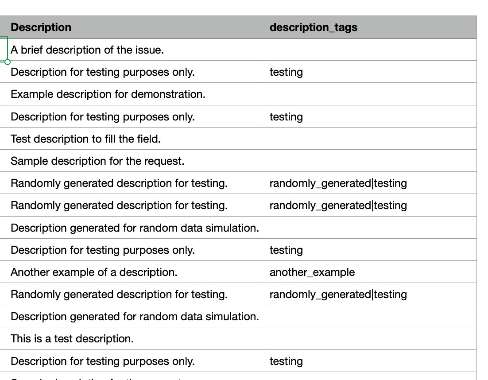
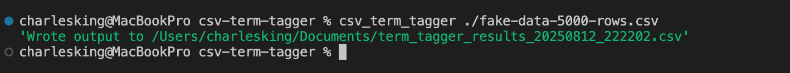

# CSV Term Tagger

## Description

Reads a CSV column's content for matches to lists of terms and adds a pipe delimited list of their associated tags to another column when the terms are found.

The terms in the terms lists of the configuration file are compared in a case-insensitive manner to the content of the search column.

Search terms must match exactly (except for case) and must be delimited from whitespace or punctuation in order to match. This prevents matching for the search term `Bill` and having it match against `billing`. Searching for `Bill` will match against `Okay, send me a bill.`.

### Example Matching Results in New CSV

<p align="center"></p>

## Installation Dependencies

You must have `git` and `uv` installed to deploy this app to your Windows system.

See how to do that here: https://github.com/cwkingjr/windows-install-gitbash-and-uv

If you are short on Bash/Terminal Knowledge pick some up cheap here: https://github.com/cwkingjr/unix-command-intro-for-windows-folks

### If you already have UV Installed

Update it to the latest version:

```bash
uv self update
```

## Common Installation Extras

If you want to use some command line interface (CLI) tools, but want to be able to use Windows Explorer to drag a file/folder (path) and drop it on an icon to run it with your selection, you can build a Windows Batch file for the CLI app to do that. Learn how here: https://github.com/cwkingjr/windows-drag-to-app-with-args

## CSV Term Tagger Installation, Update, and Removal

### Install

Using the PowerShell or Git Bash Terminal run this command at the shell prompt:

```bash
uv tool install https://github.com/cwkingjr/csv-term-tagger.git
```

### Upgrade

This is typically only needed when the developer fixes bugs, adds features, or updates the program's dependencies. In any case, it doesn't hurt anything to run it just in case.

```bash
uv tool upgrade csv-term-tagger
```

### Uninstall

```bash
uv tool uninstall csv-term-tagger
```

## CSV Term Tagger Configuration File

This tool uses tags and associated terms lists to do the content search and to add tags to the matching tags column in the CSV file that it generates.

You have to configure the processing settings in the configuration file and build out the tag_terms blocks for your tags and search terms, and place your configuration file in a specific spot where this tool expects it.

There is an example configuration in this repository that you can download and modify to make your own config file: `csv_term_tagger.toml`. To download it, click here https://github.com/cwkingjr/csv-term-tagger/blob/main/csv_term_tagger.toml and then click the `Download raw file` button on the right side of the page.

Your config file must exactly match the format in the example config toml or the schema validator will yell at you and refuse to proceed until it does.

The config file must be in your home folder, under some additional folders, like this: `/Users/<your-user-name>/.config/csv_term_tagger/csv_term_tagger.toml`.

That `.config` directory starts with a dot on purpose as thats a hidden folder (typically).

We're using this system of folders because that is convention for command line tool configs. That way, other tools can put their configs in `.config/` under a folder named for their tool, and can put whatever files they need under their folder.

If you are interested in using Git Bash, you can go into that terminal and run this command: `mkdir -p ~/.config/csv_term_tagger/` to make those folders all at one time. Then place your modified `csv_term_tagger.toml` file into that `csv_term_tagger` directory/folder.

### Invoke CSV Term Tagger

To run the tool, go to the Git Bash or PS Terminal and run (`<something>` inside angle brackets indicates this is something your are supposed to replace, replacing angles and all; meaning, leave out the angles.):

```bash
csv_term_tagger <csv-file-to-process-path>
csv_term_tagger Z:/my_csv.csv
```

#### Example CLI Output When Finished

<p align="center"></p>

### Example Batch File

If your system installs this application in the same area as mine does, you should be able to download this file https://github.com/cwkingjr/csv-term-tagger/blob/main/term_tagger.bat onto your desktop and use Windows (File) Explorer to drag a CSV file path to it and drop it on the icon to invoke the app. If it doesn't work, see the installation extras section above to reconfigure it for your installation path.
